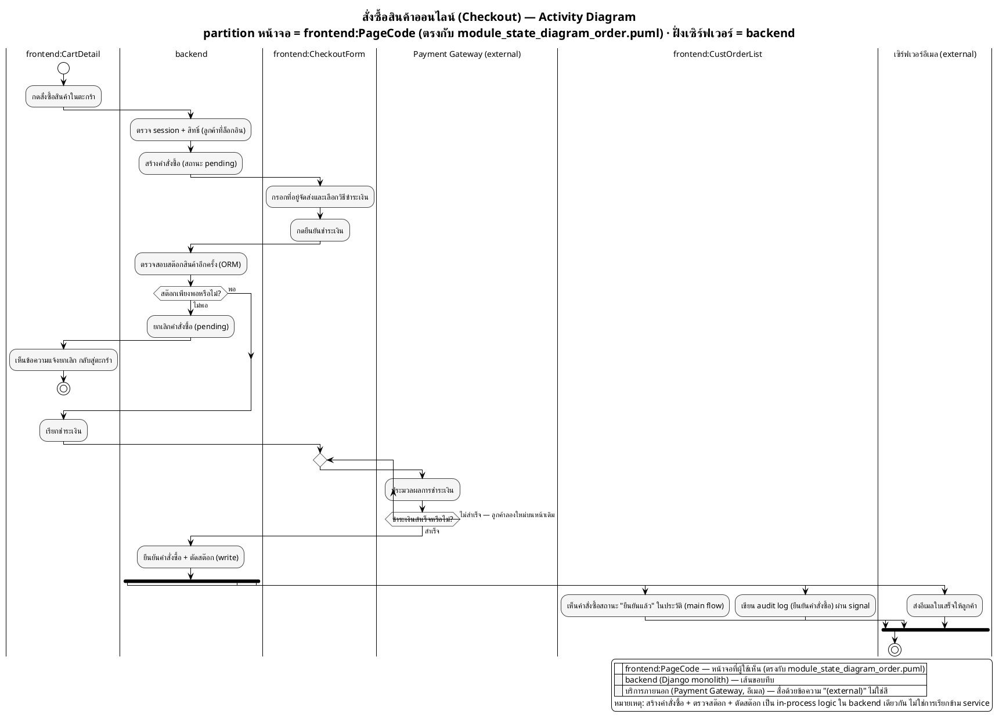

# ตัวอย่าง — Activity Diagram ที่ทำตามกฎครบทุกข้อ (Monolith)

> ตัวอย่างนี้ใช้ระบบสมมติ **"ระบบสั่งซื้อสินค้าออนไลน์"** (Django MVT monolith) เพื่อสาธิตกฎทั้งหมดใน [`activity_diagram_generate_guide.md`](../guide/activity_diagram_generate_guide.md) — เป็น**ระบบเดียวกับ** [`ui_state_diagram_example.md`](ui_state_diagram_example.md) โดยตั้งใจ เพื่อให้เห็นว่า partition ในไฟล์นี้ (`frontend:CartDetail`, `frontend:CheckoutForm`, `frontend:CustOrderList`) ต้องตรงกับชื่อ state ในไดอะแกรมนั้นทุกตัวอักษร

จุดที่ตัวอย่างนี้สาธิตให้เห็น:
- **partition หน้าจอเป็น `frontend:<PageCode>` เสมอ** — ไม่ใช่ชื่อ actor (`Customer`) ลอย ๆ แบบเดิม และทุก `PageCode` (`CartDetail`, `CheckoutForm`, `CustOrderList`) มีอยู่จริงใน `module_state_diagram_order.puml` ของ [`ui_state_diagram_example.md`](ui_state_diagram_example.md)
- **partition เปลี่ยนตามหน้าจอที่เปลี่ยนจริง** — ลูกค้าเริ่มที่ `frontend:CartDetail` แล้วถูกพาไปหน้า `frontend:CheckoutForm` ตรงกับ transition `CartDetail --> CheckoutForm` ในไดอะแกรม state · เมื่อสต๊อกไม่พอ กระบวนการพากลับไป `frontend:CartDetail` ตรงกับ transition ขาล้มเหลว `CheckoutForm --> CartDetail`
- **`backend` เดี่ยว ๆ แทนชื่อโปรเจกต์** — ไม่มี partition ชื่อ "ระบบร้านค้าออนไลน์" อีกต่อไป ใช้ `backend` คงที่ตลอดไฟล์
- **บริการภายนอกจริงเป็น partition เส้นขอบประ** — `Payment Gateway (external)` และ `เซิร์ฟเวอร์อีเมล (external)` อยู่นอกโปรเจกต์ Django
- **Loop ด้วย `repeat`/`repeat while` วนที่ `frontend:CheckoutForm` เดิม** — ชำระเงินไม่สำเร็จ วนกลับให้ลูกค้าลองใหม่บนหน้าเดิม ไม่เปลี่ยนชื่อ partition
- **Audit log + อีเมลแบบ non-blocking ด้วย `fork`/`end fork`** — ผ่าน Django signal / async task ไม่บล็อกการตอบลูกค้า
- **Monochrome ล้วน** — แยก `frontend`/`backend`/external ด้วยข้อความ ไม่ใช่สี

---

## เตรียมข้อมูลก่อนกรอก template

| ขั้นที่ | ใครทำ | เกิดที่หน้าไหน (`PageCode`) | กิจกรรม |
|---|---|---|---|
| 1 | ลูกค้า | `CartDetail` | กดสั่งซื้อสินค้าในตะกร้า |
| 2 | backend | — | ตรวจสิทธิ์ + สร้างคำสั่งซื้อ (pending) |
| 3 | ลูกค้า | `CheckoutForm` | กรอกที่อยู่/วิธีชำระเงิน แล้วกดยืนยัน |
| 4 | backend | — | ตรวจสต๊อก + เรียกชำระเงิน |
| 5a | ลูกค้า | `CartDetail` *(สต๊อกไม่พอ — ย้อนกลับ)* | เห็นข้อความยกเลิกคำสั่งซื้อ |
| 5b | ลูกค้า/Payment Gateway | `CheckoutForm` *(loop จนกว่าจะสำเร็จ)* | ชำระเงิน |
| 6 | backend | — | ยืนยันคำสั่งซื้อ + ตัดสต๊อก (write) |
| 7 | ลูกค้า | `CustOrderList` | เห็นคำสั่งซื้อในประวัติพร้อมสถานะ "ยืนยันแล้ว" |

---



---

## ตรวจก่อนส่ง

ต้องไม่มี output ทั้งคู่ — ยืนยันว่าทุก `frontend:PageCode` ในไฟล์นี้มีอยู่จริงใน state diagram และไม่มีหน้าไหนถูกคิดขึ้นเองลอย ๆ:

```bash
grep -ohE '\|frontend:[A-Za-z][A-Za-z0-9]*\|' order_activity_checkout.puml | tr -d '|' | cut -d: -f2 | sort -u | while read p; do grep -qE " as $p$" module_state_diagram_order.puml || echo "ORPHAN: $p"; done
```

ผลตรวจ: `CartDetail`, `CheckoutForm`, `CustOrderList` — ทั้ง 3 ชื่อมีอยู่จริงใน [`ui_state_diagram_example.md`](ui_state_diagram_example.md) → ไม่มี output → ผ่าน
