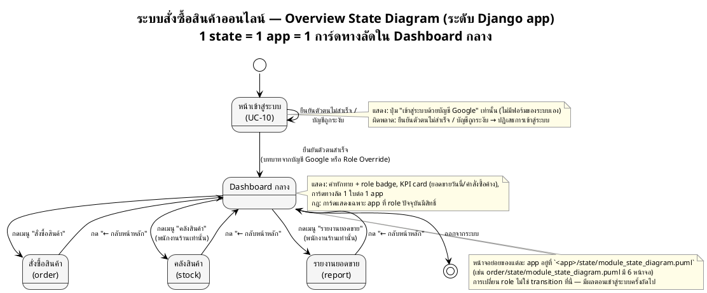

# ตัวอย่าง — UI State Diagram ที่ทำตามกฎครบทุกข้อ

> ตัวอย่างนี้ใช้ระบบสมมติ **"ระบบสั่งซื้อสินค้าออนไลน์"** (Django MVT monolith) — **ระบบเดียวกับ** [`activity_diagram_example.md`](activity_diagram_example.md) เพื่อสาธิตให้เห็นชัดว่า **activity diagram ตัวนั้นแปลงเป็น state diagram ได้อย่างไร** ตามกฎใน [`ui_state_diagram_generate_guide.md`](../guide/ui_state_diagram_generate_guide.md) — ไม่ผูกกับโครงงานใดโครงงานหนึ่งโดยเฉพาะ ใช้เป็นตัวอย่างอ้างอิงได้กับทุกโปรเจกต์

จุดที่ตัวอย่างนี้สาธิตให้เห็น:
- **แปลงจาก activity diagram ตรง ๆ ตามตาราง §3** — `if (สต๊อกไม่พอ)` → transition ขาล้มเหลว · `repeat while (ชำระเงินไม่สำเร็จ)` → self-transition · `|Payment Gateway (external)|` → label บนเส้น **ไม่ใช่ state** · `fork` (อีเมลใบเสร็จ) → บรรทัด `แจ้งเตือน:` ใน note
- **ไม่มี state ที่เป็นสถานะข้อมูล** — `pending`/`ยืนยันแล้ว`/`ยกเลิก` อยู่บน label ของ transition และใน note เท่านั้น (guide §0)
- **`<<extend>>` ไม่แยกหน้า** — UC-02 (ค้นหา/กรอง) เป็น self-transition บน `ProductList` ไม่ใช่ state ใหม่
- **`<<include>>` มีเส้นรองรับ** — เข้า `CheckoutForm` ได้จาก `CartDetail` ทางเดียว ไม่มีทางเข้าอื่น
- **role prefix เฉพาะคู่ที่ชนกันจริง** — `CustOrderList` vs `StaffOrderList` (ชนกัน) แต่ `ProductDetail` ไม่มี prefix (role เดียวใช้)
- **action ที่ไม่เปลี่ยน URL เป็น self-transition** — UC-07 (ยกเลิกคำสั่งซื้อ) กดในตารางแล้วอยู่หน้าเดิม
- **UC ที่ไม่มีหน้าจอถูกระบุไว้ ไม่ได้หายไปเงียบ ๆ** — UC-09 เป็น background job
- **ไม่มี unreachable state / dead-end** — ผ่าน `grep` ทั้ง 2 ชุด (ดูท้ายไฟล์)
- **ขั้นตอนสุดท้าย: audit `page_code` ใน activity diagram** — พบ 3 จุดที่ activity อ้างชื่อหน้าผิด/ซ้ำ แก้ให้ตรงทันทีโดยไม่ต้องถาม พร้อมบันทึกร่องรอย (guide §12)
- **Monochrome ล้วน** — แยกโซน role ด้วยชื่อโซน ไม่ใช่สี

---

## ขั้นเตรียม 1 — จาก UC สู่ `page_code` (guide §4.2)

อ่าน **Post-condition** เพื่อหาคำนาม (ไม่ใช่ชื่อ UC ที่เป็นกริยา) แล้วอ่าน **Basic Flow** เพื่อเลือก suffix:

| UC | ชื่อ UC (กริยา) | Post-condition → คำนาม | Basic Flow → suffix | `page_code` | Actor |
|---|---|---|---|---|---|
| UC-01 | ดูรายการสินค้า | "ลูกค้าเห็นสินค้าทั้งหมดในร้าน" → `Product` | เปิดดูหลายรายการ + แบ่งหน้า → `List` | `ProductList` | ลูกค้า |
| UC-02 | ค้นหาและกรองสินค้า | *(extend UC-01)* | — | `ProductList` *(ไม่แยกหน้า)* | ลูกค้า |
| UC-03 | ดูรายละเอียดสินค้า | "ลูกค้าเห็นข้อมูลครบของสินค้า 1 ชิ้น" → `Product` | เปิดดู 1 รายการ → `Detail` | `ProductDetail` | ลูกค้า |
| UC-04 | จัดการตะกร้าสินค้า | "ตะกร้ามีสินค้าและจำนวนที่ต้องการ" → `Cart` | ดู+แก้ไขตะกร้าของตัวเอง 1 ใบ → `Detail` | `CartDetail` | ลูกค้า |
| UC-05 | สั่งซื้อและชำระเงิน | "มีคำสั่งซื้อสถานะยืนยันแล้ว" → `Checkout` | กรอกที่อยู่/วิธีชำระ แล้วกดยืนยัน → `Form` | `CheckoutForm` | ลูกค้า |
| UC-06 | ดูประวัติคำสั่งซื้อ | "ลูกค้าเห็นคำสั่งซื้อย้อนหลังของตัวเอง" → `Order` | เปิดดูหลายรายการ → `List` | `CustOrderList` ¹ | ลูกค้า |
| UC-07 | ยกเลิกคำสั่งซื้อ | "คำสั่งซื้อมีสถานะยกเลิก" | กดในตาราง แล้วอยู่หน้าเดิม | *(self-transition บน `CustOrderList`)* | ลูกค้า |
| UC-08 | จัดการสถานะคำสั่งซื้อ | "คำสั่งซื้อถูกอัปเดตสถานะจัดส่ง" → `Order` | เปิดดูหลายรายการ + กดอัปเดต → `List` | `StaffOrderList` ¹ | พนักงานร้าน |
| UC-09 | ยกเลิกคำสั่งซื้อค้างชำระอัตโนมัติ | *(ระบบทำเอง ไม่มีผู้กด)* | — | **— ไม่มีหน้าจอ** | — |

¹ UC-06 กับ UC-08 ได้ `Order` + `List` ตรงกันทั้งคู่ → **ชนกันจริง** จึงเติม prefix role ตาม guide §4.2 ขั้น 3 ส่วน `ProductDetail`/`CartDetail` ไม่ชนกับใคร จึงไม่ต้องมี prefix

---

## ขั้นเตรียม 2 — จาก Activity Diagram สู่ State/Transition (guide §3)

เดินไฟล์ [`order_activity_checkout`](activity_diagram_example.md) ทีละบรรทัด แล้วแปลงตามตาราง §3:

| บรรทัดใน `order_activity_checkout.puml` | partition | แปลงเป็น |
|---|---|---|
| `:กดสั่งซื้อสินค้าในตะกร้า;` | `\|Customer\|` | transition `CartDetail --> CheckoutForm : กด "สั่งซื้อสินค้า"` |
| `:ตรวจ session + สิทธิ์;` · `:สร้างคำสั่งซื้อ (pending);` · `:ตรวจสอบสต๊อก;` | `\|ระบบร้านค้าออนไลน์\|` | **ไม่ใช่ state** — เป็นการประมวลผลบนเส้นข้างบน |
| `if (สต๊อกเพียงพอ?) then (ไม่พอ) :ยกเลิกคำสั่งซื้อ; stop` | ระบบ | transition ขาล้มเหลว `CheckoutForm --> CartDetail`(+ guard) — **ไม่สร้าง state ชื่อ Error** |
| `repeat` … `\|Payment Gateway (external)\|` … `repeat while (ชำระเงินสำเร็จ?) is (ไม่สำเร็จ)` | external | **self-transition** `CheckoutForm --> CheckoutForm` · partition external เป็นแค่ข้อความบน label |
| `:ยืนยันคำสั่งซื้อ + ตัดสต๊อก (write);` | ระบบ | ส่วนที่ 3 ของ label: `→ สถานะ "ยืนยันแล้ว"` |
| `fork` → `:เขียน audit log;` / `\|เซิร์ฟเวอร์อีเมล (external)\| :ส่งอีเมลใบเสร็จ;` | ระบบ/external | **ไม่ใช่ transition** — เป็นบรรทัด `แจ้งเตือน:` ใน note ของ `CustOrderList` |
| `stop` (จบ main flow) | — | transition `CheckoutForm --> CustOrderList` (ปลายทางที่ผู้ใช้เห็นผลสำเร็จ) |

> สังเกตว่า activity diagram ที่มี 10 กว่าขั้นตอน แปลงเป็น **state ใหม่เพียง 1 ตัว** (`CheckoutForm`) กับ transition 4 เส้น — เพราะขั้นตอนส่วนใหญ่อยู่ใน partition ของระบบ/บริการภายนอก ซึ่งไม่มีหน้าจอ (guide §3)

---

## ผลลัพธ์ 1 — `order/state/module_state_diagram.puml`

```plantuml
@startuml module_state_diagram_order
' ══════════════════════════════════════════════════════════════════
' ระบบสั่งซื้อสินค้าออนไลน์ — UI State Transition Diagram (ระดับหน้าจอ) ของ app `order`
' อ้างอิง: order/proposal/usecase_description.md,
'          order/activity/*.puml (รวม order_activity_checkout.puml)
'
' รองรับภาษาไทย — อ่านก่อน render:
' 1. บันทึกไฟล์นี้เป็น UTF-8 (ไม่ต้องมี BOM) เสมอ
' 2. ถ้า render ผ่าน CLI (plantuml.jar) ต้องระบุ flag encoding ด้วย:
'      java -Dfile.encoding=UTF-8 -jar plantuml.jar -charset UTF-8 module_state_diagram_order.puml
' 3. บังคับใช้ Smetana (pure-Java layout engine) แทน Graphviz/dot
'    เพราะ Graphviz บางระบบ (โดยเฉพาะ Windows) อ่าน UTF-8 ไม่ตรง ทำให้ตัวอักษรไทยเพี้ยน/หาย
' 4. ฟอนต์: Windows = "TH Sarabun New" · Linux/PlantUML server = "Noto Sans Thai"
'
' กฎที่ไดอะแกรมนี้รักษาไว้:
'   - 1 state = 1 หน้าจอ = 1 URL — สถานะคำสั่งซื้อ (pending/ยืนยันแล้ว/ยกเลิก) อยู่บน label + note
'   - UC-02 เป็น <<extend>> ของ UC-01 → เป็น self-transition ไม่ใช่ state ใหม่
'   - UC-05 <<include>> UC-04 → เข้า CheckoutForm ได้จาก CartDetail ทางเดียว
'   - UC-09 (auto-cancel job) ไม่มีหน้าจอ → ระบุใน note ท้ายไฟล์
' ══════════════════════════════════════════════════════════════════
!pragma layout smetana
skinparam defaultFontName "TH Sarabun New"
skinparam defaultFontSize 14

!theme plain
skinparam titleFontName "TH Sarabun New"
skinparam titleFontSize 20
skinparam noteFontName "TH Sarabun New"
skinparam noteFontSize 11
skinparam ArrowFontName "TH Sarabun New"
skinparam ArrowFontSize 11

' ===== Monochrome เท่านั้น — ไม่มีโซนไหนสีต่างจากที่อื่น =====
skinparam state {
  BackgroundColor #F5F5F5
  BorderColor #424242
  FontName "TH Sarabun New"
  FontSize 13
  ArrowFontName "TH Sarabun New"
}
skinparam note {
  BackgroundColor #FFFDE7
  BorderColor #9E9E9E
}

title ระบบสั่งซื้อสินค้าออนไลน์ — UI State Diagram: app `order`\n1 state = 1 หน้าจอ = 1 URL · เส้น = ปุ่ม/ลิงก์ที่กดได้จริง

' ═════════ โซนลูกค้า (Customer — UC-01 ถึง UC-07) ═════════
state "ลูกค้า (Customer)" as CustomerZone {

  state "รายการสินค้า\n(UC-01, extend UC-02)" as ProductList
  note right of ProductList
    แสดง: รูปสินค้า, ชื่อ, ราคา, สต๊อกคงเหลือ ต่อรายการ (pagination)
    ฟิลด์: ช่องค้นหาชื่อสินค้า + ตัวกรองหมวดหมู่/ช่วงราคา (UC-02)
    ว่าง: "ยังไม่มีสินค้าในร้าน" / "ไม่พบสินค้าที่ค้นหา"
  end note

  state "รายละเอียดสินค้า\n(UC-03)" as ProductDetail
  note right of ProductDetail
    แสดง: รูปหลัก, ชื่อ, ราคา, รายละเอียด, สต๊อกคงเหลือ
    ปุ่ม: "เพิ่มลงตะกร้า" (แสดงเฉพาะเมื่อสต๊อก > 0)
    ผิดพลาด: สินค้าถูกปิดการขายแล้ว → "ไม่พบสินค้านี้"
  end note

  state "ตะกร้าสินค้า\n(UC-04)" as CartDetail
  note right of CartDetail
    แสดง: รายการสินค้าในตะกร้า + ราคารวมทั้งบิล
    ฟิลด์: ช่องแก้ไขจำนวนต่อรายการ, ปุ่มลบรายการ
    ว่าง: "ยังไม่มีสินค้าในตะกร้า"
    ผิดพลาด: จำนวนที่กรอกเกินสต๊อกจริง → แจ้งเตือน ไม่อนุญาตให้เพิ่ม
  end note

  state "ยืนยันคำสั่งซื้อและชำระเงิน\n(UC-05, include UC-04)" as CheckoutForm
  note right of CheckoutForm
    ฟิลด์: ที่อยู่จัดส่ง (บังคับ), เบอร์ติดต่อ (บังคับ), วิธีชำระเงิน (บังคับ)
    ผิดพลาด: กรอกไม่ครบ → validation error /
    สต๊อกไม่พอตอนกดยืนยัน → ยกเลิกคำสั่งซื้อ พากลับตะกร้า /
    ชำระเงินไม่สำเร็จ → คงอยู่หน้านี้ให้ลองใหม่
    กฎ: ตัดสต๊อกจริงเมื่อชำระเงินสำเร็จเท่านั้น (ไม่ใช่ตอนสร้างคำสั่งซื้อ)
  end note

  state "ประวัติคำสั่งซื้อของฉัน\n(UC-06)" as CustOrderList
  note right of CustOrderList
    แสดง: คำสั่งซื้อย้อนหลังของฉัน + ป้ายสถานะ
    (รอชำระเงิน / ยืนยันแล้ว / กำลังจัดส่ง / ส่งสำเร็จ / ยกเลิก)
    ว่าง: "ยังไม่มีคำสั่งซื้อ"
    แจ้งเตือน: อีเมลใบเสร็จส่งอัตโนมัติเมื่อชำระเงินสำเร็จ (fork ใน activity)
  end note

  [*] --> ProductList

  ' --- นำทางปกติ ---
  ProductList --> ProductDetail : เลือกสินค้า (UC-03)
  ProductDetail --> ProductList : กด "กลับ"
  ProductList --> CartDetail : กด "ตะกร้า" บน top bar
  ProductDetail --> CartDetail : กด "เพิ่มลงตะกร้า"\n(สต๊อกคงเหลือ > 0)
  CartDetail --> ProductList : กด "เลือกซื้อสินค้าเพิ่ม"
  ProductList --> CustOrderList : กดเมนู "คำสั่งซื้อของฉัน"
  CustOrderList --> ProductList : กด "กลับ"

  ' --- แปลงจาก order_activity_checkout.puml (ดูตารางขั้นเตรียม 2) ---
  CartDetail --> CheckoutForm : กด "สั่งซื้อสินค้า"\n(ตะกร้ามีสินค้า ≥ 1 รายการ)
  CheckoutForm --> CartDetail : สต๊อกไม่พอตอนกดยืนยัน\n→ ยกเลิกคำสั่งซื้อ (pending)
  CheckoutForm --> CheckoutForm : ชำระเงินไม่สำเร็จ (Payment Gateway)\n→ ให้ลูกค้าลองใหม่
  CheckoutForm --> CheckoutForm : กรอกข้อมูลไม่ครบ\n→ แสดง validation error
  CheckoutForm --> CustOrderList : กด "ยืนยันชำระเงิน" สำเร็จ\n→ สถานะ "ยืนยันแล้ว" + ตัดสต๊อก

  ' --- action ที่ทำเสร็จแล้วยังอยู่หน้าเดิม (ไม่เปลี่ยน URL) ---
  ProductList --> ProductList : กด "ค้นหา"/เลือกตัวกรอง (UC-02)
  CartDetail --> CartDetail : แก้ไขจำนวน/ลบรายการ (UC-04)
  CustOrderList --> CustOrderList : กด "ยกเลิกคำสั่งซื้อ" (UC-07)\n(เฉพาะสถานะ "รอชำระเงิน")\n→ สถานะ "ยกเลิก"
}

' ═════════ โซนพนักงานร้าน (Staff — UC-08) ═════════
' โซนต่างกันไม่มีเส้นเชื่อมกัน — 1 session = 1 role
state "พนักงานร้าน (Staff)" as StaffZone {

  state "คำสั่งซื้อทั้งร้าน\n(UC-08)" as StaffOrderList
  note right of StaffOrderList
    แสดง: คำสั่งซื้อทุกคน + ป้ายสถานะ + ชื่อลูกค้า
    ฟิลด์: ค้นหาเลขคำสั่งซื้อ/ชื่อลูกค้า + ตัวกรองสถานะ
    ว่าง: "ไม่พบคำสั่งซื้อ"
    กฎ: อัปเดตสถานะได้เฉพาะคำสั่งซื้อที่ "ยืนยันแล้ว" ขึ้นไป
  end note

  [*] --> StaffOrderList

  StaffOrderList --> StaffOrderList : กด "อัปเดตสถานะจัดส่ง" (UC-08)\n→ สถานะ "กำลังจัดส่ง" / "ส่งสำเร็จ"
}

note bottom of CustomerZone
  ครอบคลุม UC-01 ถึง UC-07 (7 use case ของลูกค้า)
  ไม่นับเป็น state/transition: การส่งอีเมลใบเสร็จและ audit log
  (fork ใน order_activity_checkout.puml — ไม่เปลี่ยนหน้าจอของผู้กด)
end note

note bottom of StaffZone
  ครอบคลุม UC-08 (1 use case ของพนักงานร้าน)
  UC ที่ไม่มีหน้าจอ: UC-09 ยกเลิกคำสั่งซื้อค้างชำระอัตโนมัติ
  (background job รายวัน — ไม่มี actor กดปุ่ม จึงไม่มี state)
end note

@enduml
```



---

## ผลลัพธ์ 2 — `architecture/overview_state_diagram.puml`



---

## ผลลัพธ์ 3 — `order/state/module_state_diagram.md` (ตาราง Traceability)

### สรุปจำนวน

| ตัวชี้วัด | จำนวน | ต้องตรงกับ |
|---|---|---|
| UC ทั้งหมดของ app `order` | 9 | `usecase_description.md` |
| UC ที่มีหน้าจอ | 8 | — |
| UC ที่ไม่มีหน้าจอ (background job) | 1 (UC-09) | note ท้ายไดอะแกรม |
| **`page_code` ที่ไม่ซ้ำ = จำนวนหน้าจอ** | **6** | 6 `path()` ใน `urls.py` = 6 ไฟล์ใน `mockup/pages/` |

> 9 UC → 6 หน้าจอ เพราะ UC-02 ยุบเข้า `ProductList` (extend), UC-07 เป็น self-transition บน `CustOrderList`, และ UC-09 ไม่มีหน้าจอ

### ตาราง UC → หน้าจอ → ไฟล์

| UC | ชื่อ Use Case | Actor | ไฟล์ activity ที่ใช้ map | `page_code` | URL name | Template | ไฟล์ mockup |
|---|---|---|---|---|---|---|---|
| UC-01 | ดูรายการสินค้า | ลูกค้า | `activity/activity_uc01_product_list.puml` | `ProductList` | `order:product_list` | `order/product_list.html` | `pages/page-product-list.html` |
| UC-02 | ค้นหาและกรองสินค้า | ลูกค้า | `activity/activity_uc02_search.puml` | `ProductList` *(extend — ไม่แยกหน้า)* | (เดียวกัน) | (เดียวกัน) | (เดียวกัน) |
| UC-03 | ดูรายละเอียดสินค้า | ลูกค้า | `activity/activity_uc03_product_detail.puml` | `ProductDetail` | `order:product_detail` | `order/product_detail.html` | `pages/page-product-detail.html` |
| UC-04 | จัดการตะกร้าสินค้า | ลูกค้า | `activity/activity_uc04_cart.puml` | `CartDetail` | `order:cart_detail` | `order/cart_detail.html` | `pages/page-cart-detail.html` |
| UC-05 | สั่งซื้อและชำระเงิน | ลูกค้า | `activity/order_activity_checkout.puml` | `CheckoutForm` | `order:checkout_form` | `order/checkout_form.html` | `pages/page-checkout-form.html` |
| UC-06 | ดูประวัติคำสั่งซื้อ | ลูกค้า | `activity/activity_uc06_history.puml` | `CustOrderList` | `order:cust_order_list` | `order/cust_order_list.html` | `pages/page-cust-order-list.html` |
| UC-07 | ยกเลิกคำสั่งซื้อ | ลูกค้า | `activity/activity_uc07_cancel.puml` | `CustOrderList` *(self-transition — ไม่แยกหน้า)* | (เดียวกัน) | (เดียวกัน) | (เดียวกัน) |
| UC-08 | จัดการสถานะคำสั่งซื้อ | พนักงานร้าน | `activity/activity_uc08_order_status.puml` | `StaffOrderList` | `order:staff_order_list` | `order/staff_order_list.html` | `pages/page-staff-order-list.html` |
| UC-09 | ยกเลิกคำสั่งซื้อค้างชำระอัตโนมัติ | — | `activity/activity_uc09_auto_cancel.puml` | **— ไม่มีหน้าจอ** (background job รายวัน ไม่มี actor กดปุ่ม) | — | — | — |

### ผลการ Audit `page_code` ใน activity diagram (guide §12)

`order_activity_checkout.puml` ([`activity_diagram_example.md`](activity_diagram_example.md)) เขียน partition เป็น `frontend:CartDetail` → `frontend:CheckoutForm` → `frontend:CustOrderList` ตรงตาม [`activity_diagram_generate_guide.md`](../guide/activity_diagram_generate_guide.md) §1 มาตั้งแต่แรกอยู่แล้ว (ไม่ใช่ partition ชื่อ actor + comment อธิบายหน้าลอย ๆ) รัน audit ตาม §12.3 แล้ว **ไม่พบจุดที่ต้องแก้**:

```bash
# ขั้น 2 — orphan check: ไม่มี output
grep -ohE '\|frontend:[A-Za-z][A-Za-z0-9]*\|' ../activity/*.puml | tr -d '|' | cut -d: -f2 | sort -u | while read p; do grep -qE " as $p$" module_state_diagram_order.puml || echo "ORPHAN: $p"; done
```

```bash
# ขั้น 4 — transition ระดับคู่: ดึงลำดับ frontend:X แล้วเทียบกับ arrow ใน state diagram
for f in ../activity/*.puml; do
  grep -oE '\|frontend:[A-Za-z][A-Za-z0-9]*\|' "$f" | tr -d '|' | cut -d: -f2 | uniq | awk 'NR>1{print prev" --> "$0} {prev=$0}'
done | sort -u
# ผลลัพธ์: CartDetail-->CheckoutForm, CheckoutForm-->CartDetail (สต๊อกไม่พอ), CheckoutForm-->CustOrderList
# ทั้ง 3 คู่มี arrow จริงใน module_state_diagram_order.puml (§6.5)
```

**ตัวอย่างสมมติ — ถ้า activity ไฟล์นี้เขียนมาก่อนกฎ `frontend:<PageCode>` มีผล** (partition ยังเป็นชื่อ actor และอธิบายหน้าด้วยประโยคลอย ๆ) จะพบและแก้แบบนี้:

| # | ไฟล์ activity | เดิม partition/ประโยค | แก้เป็น | ประเภท (§12.1) |
|---|---|---|---|---|
| 1 | `activity/order_activity_checkout.puml` | `\|Customer\|` ตลอดไฟล์ + `:แสดงหน้ายืนยันให้ลูกค้า;` | `\|frontend:CustOrderList\|` (ปลายทางจริงตาม state diagram คือหน้าประวัติ ไม่ใช่หน้ายืนยันแยก) | (ก) อ้างผิดหน้า + (ง) partition ไม่เปลี่ยนตามหน้าจริง |
| 2 | `activity/activity_uc04_cart.puml` | `:กลับไปหน้าสรุปตะกร้า;` (ไม่มี partition ชัดเจน) | `\|frontend:CartDetail\|` | (ค) สร้างหน้าซ้ำ — เป็นหน้าเดียวกับที่ไฟล์อื่นเรียก |

สังเกตว่าทั้ง 2 จุดสมมตินี้แก้แค่ **partition/ชื่อที่ใช้เรียกหน้า** ไม่ได้แก้ขั้นตอนหรือเงื่อนไขใด ๆ — จึงเข้าเกณฑ์ "แก้ได้เลยไม่ต้องถาม" ตาม §12.1 (ถ้าเป็นการเพิ่ม/ลบ decision หรือเปลี่ยน business rule/ลำดับ จะเข้า §11 ต้องถามก่อน — ดูกรณีจริงที่ [`ui_state_diagram_generate_guide.md`](../guide/ui_state_diagram_generate_guide.md) §12.1 (จ) ยกตัวอย่างไว้)

### จุดที่เอกสารต้นทางยังต้องยืนยันก่อนแก้ (guide §11 — เชิงตรรกะเท่านั้น)

| # | จุดที่ขัดกัน | ไฟล์:บรรทัด (ฝั่ง A) | ไฟล์:บรรทัด (ฝั่ง B) | สถานะ |
|---|---|---|---|:---:|
| — | *(ตัวอย่างนี้ไม่มีจุดขัดแย้งเชิงตรรกะ — 3 จุดข้างบนเป็นเรื่องชื่อหน้าจึงแก้ได้เลยตาม §12 ถ้าเจอกรณีขั้นตอน/เงื่อนไขขัดกัน ให้บันทึกที่นี่แล้วถามก่อน ห้ามแก้เอง)* | — | — | — |

---

## ผลการตรวจโครงสร้าง (guide §6.5)

รัน 2 คำสั่งกับ `module_state_diagram_order.puml` แล้ว **ไม่มี output ทั้งคู่** = ผ่าน:

```bash
grep -oE ' as [A-Za-z][A-Za-z0-9]*$' module_state_diagram_order.puml | sed 's/ as //' | sort -u | while read p; do grep -qE -- "--> +$p( |$)" module_state_diagram_order.puml || echo "UNREACHABLE: $p"; done
```

```bash
grep -oE ' as [A-Za-z][A-Za-z0-9]*$' module_state_diagram_order.puml | sed 's/ as //' | sort -u | while read p; do grep -qE "(^|[^-])$p +-->" module_state_diagram_order.puml || echo "DEAD-END: $p"; done
```

> คำสั่งจับเฉพาะ leaf state — ชื่อโซน `CustomerZone` / `StaffZone` (composite ที่ลงท้ายด้วย `{`) ถูกข้ามโดยอัตโนมัติ ซึ่งถูกต้อง เพราะโซนไม่ต้องมี transition ของตัวเอง

ตรวจด้วยตาอีกชั้น — ทุกหน้ามีทั้งขาเข้าและขาออก:

| `page_code` | ขาเข้าจาก | ขาออกไป |
|---|---|---|
| `ProductList` | `[*]`, `ProductDetail`, `CartDetail`, `CustOrderList`, ตัวเอง | `ProductDetail`, `CartDetail`, `CustOrderList`, ตัวเอง |
| `ProductDetail` | `ProductList` | `ProductList`, `CartDetail` |
| `CartDetail` | `ProductList`, `ProductDetail`, `CheckoutForm`, ตัวเอง | `ProductList`, `CheckoutForm`, ตัวเอง |
| `CheckoutForm` | `CartDetail`, ตัวเอง | `CartDetail`, `CustOrderList`, ตัวเอง |
| `CustOrderList` | `ProductList`, `CheckoutForm`, ตัวเอง | `ProductList`, ตัวเอง |
| `StaffOrderList` | `[*]`, ตัวเอง | ตัวเอง |

> `StaffOrderList` มีขาเข้าจาก `[*]` ของโซน Staff และวนกลับตัวเอง — **ไม่ถือว่า dead-end** เพราะเป็นหน้าแรกของ role นั้นและมีขาออก (self-transition) การออกจาก app ไปที่ Dashboard เป็นเรื่องของ `overview_state_diagram.puml` ไม่ใช่ไฟล์ระดับ module
