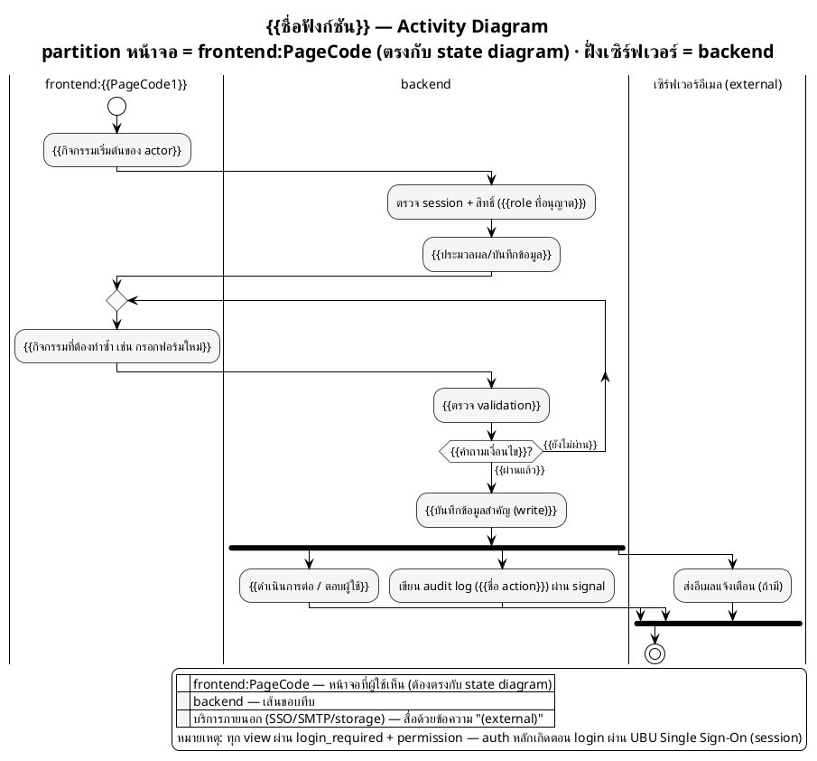

# Template — Activity Diagram แบบมี Swimlane (`.puml`)

> วิธีใช้: คัดลอกโค้ด PlantUML ด้านล่างไปที่ `<app>/activity_<ชื่อฟังก์ชัน>.puml`
> แทนที่ `{{...}}` ด้วยข้อมูลจริง และลบ/เพิ่ม partition, activity, fork, loop ตามจำนวนจริงของกระบวนการ
> ต้องทำตามกฎใน [`activity_diagram_generate_guide.md`](../guide/activity_diagram_generate_guide.md) ทุกข้อ โดยเฉพาะ **partition หน้าจอต้องเป็น `frontend:<PageCode>` ที่ตรงกับ `module_state_diagram.puml`**, **ฝั่งเซิร์ฟเวอร์ใช้ `backend` เดี่ยว ๆ (ไม่ใช่ชื่อโปรเจกต์)**, **ไม่มี API Gateway/JWT — auth เกิดตอน login เท่านั้น**, และ **ห้ามใช้สีหลายโทน (monochrome เท่านั้น)**
> ก่อนกรอก ต้องรู้ `PageCode` ของทุกหน้าที่ flow นี้ผ่านแล้ว — เปิด `<app>/state/module_state_diagram.puml` ไว้ข้าง ๆ (ดู [`ui_state_diagram_generate_guide.md`](../guide/ui_state_diagram_generate_guide.md) ถ้ายังไม่มี state diagram ให้ทำก่อนไฟล์นี้)
> ดูตัวอย่างที่กรอกครบแล้วได้ที่ [`activity_diagram_example.md`](../example/activity_diagram_example.md)

---

## เตรียมข้อมูลก่อนกรอก template

ไล่ Basic Flow ของ UC นี้ทีละขั้น แล้วกรอกตารางนี้ก่อน — ตารางนี้เองคือโครงของไดอะแกรม (แถวไหนหน้าจอเปลี่ยนคือจุดที่ partition ต้องเปลี่ยนตาม):

| ขั้นที่ | ใครทำ | เกิดที่หน้าไหน (`PageCode` จาก state diagram) | กิจกรรม |
|---|---|---|---|
| 1 | Actor | `{{PageCode1}}` | {{กิจกรรมเริ่มต้น}} |
| 2 | backend | — | {{ตรวจสอบ/ประมวลผล}} |
| 3 | Actor | `{{PageCode2}}` *(ถ้าเปลี่ยนหน้า)* | {{กิจกรรมถัดไป}} |

---



---

## ตรวจก่อนส่ง

```bash
grep -ohE '\|frontend:[A-Za-z][A-Za-z0-9]*\|' {{app}}_activity_{{ชื่อฟังก์ชัน}}.puml | tr -d '|' | cut -d: -f2 | sort -u | while read p; do grep -qE " as $p$" module_state_diagram.puml || echo "ORPHAN: $p"; done
```

ต้องไม่มี output — ถ้ามี แปลว่า `PageCode` ที่อ้างในไฟล์นี้ยังไม่มีอยู่จริงใน state diagram (แก้ state diagram ก่อนตาม §1.4 ของ guide ห้ามตั้งชื่อหน้าใหม่ในไฟล์นี้เอง) แล้วเดิน [checklist §7 ของ guide](../guide/activity_diagram_generate_guide.md#7-checklist-ก่อนส่งไดอะแกรม) ให้ครบทุกข้อ
