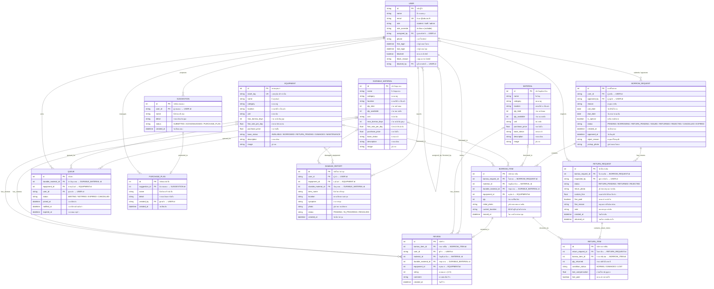

# แผนภาพ ERD อ้างอิงทั้งหมด 13 ตาราง (YuemDee Database Schema)

```mermaid
erDiagram
    USER {
        string id PK "รหัสผู้ใช้"
        string name "ชื่อ-นามสกุล"
        string email UK "อีเมล @ubu.ac.th"
        string role "student / staff / admin"
        string role_override "สิทธิ์พิเศษ (nullable)"
        string assigned_by FK "ผู้แต่งตั้งสิทธิ์ → USER.id"
        string phone "เบอร์โทรศัพท์"
        datetime first_login "เข้าสู่ระบบครั้งแรก"
        datetime last_login "เข้าสู่ระบบล่าสุด"
        boolean blocked "สถานะระงับสิทธิ์"
        string block_reason "เหตุผลการระงับสิทธิ์"
        string blocked_by FK "ผู้สั่งระงับสิทธิ์ → USER.id"
    }

    MATERIAL {
        int id PK "รหัสวัสดุสิ้นเปลือง"
        string name "ชื่อวัสดุ"
        string category "หมวดหมู่"
        string location "สถานที่ตั้งวางในคลัง"
        int qty_total "จำนวนทั้งหมด"
        int qty_available "จำนวนคงเหลือ"
        string unit "หน่วยนับ"
        float purchase_price "ราคาจัดซื้อ"
        string base_status "สถานะคลัง"
        string description "รายละเอียด"
        string image "รูปภาพ"
    }

    DURABLE_MATERIAL {
        int id PK "รหัสวัสดุคงทน"
        string name "ชื่อวัสดุคงทน"
        string category "หมวดหมู่"
        string location "สถานที่ตั้งวางในคลัง"
        int qty_total "จำนวนทั้งหมด"
        int qty_available "จำนวนคงเหลือ"
        string unit "หน่วยนับ"
        int max_borrow_days "จำนวนวันยืมสูงสุด"
        float fine_rate_per_day "อัตราค่าปรับต่อวัน"
        float purchase_price "ราคาจัดซื้อ"
        string base_status "สถานะคลัง"
        string description "รายละเอียด"
        string image "รูปภาพ"
    }

    EQUIPMENT {
        int id PK "รหัสครุภัณฑ์"
        string asset_tag UK "เลขครุภัณฑ์ประจำชิ้น"
        string name "ชื่อครุภัณฑ์"
        string category "หมวดหมู่"
        string location "สถานที่ตั้งวางในคลัง"
        string unit "หน่วยนับ"
        int max_borrow_days "จำนวนวันยืมสูงสุด"
        float fine_rate_per_day "อัตราค่าปรับต่อวัน"
        float purchase_price "ราคาจัดซื้อ"
        string base_status "AVAILABLE / BORROWED / RETURN_PENDING / DAMAGED / MAINTENANCE"
        string description "รายละเอียด"
        string image "รูปภาพ"
    }

    BORROW_REQUEST {
        int id PK "เลขที่ใบคำขอ"
        string user_id FK "ผู้ขอยืม → USER.id"
        string approved_by FK "ผู้อนุมัติ → USER.id"
        string reason "เหตุผลการยืม"
        date use_date "วันที่เริ่มใช้งาน"
        date due_date "วันครบกำหนดคืน"
        boolean is_special "ขอยืมกรณีพิเศษ"
        string status "PENDING / BORROWING / RETURN_PENDING / ISSUED / RETURNED / REJECTED / CANCELLED / EXPIRED"
        datetime created_at "วันที่ส่งคำขอ"
        datetime approved_at "วันที่อนุมัติ"
        string reject_reason "เหตุผลที่ไม่อนุมัติ"
        string pickup_photo "รูปถ่ายตอนรับของ"
    }

    BORROW_ITEM {
        int id PK "รหัสรายการยืม"
        int borrow_request_id FK "ใบคำขอ → BORROW_REQUEST.id"
        int material_id FK "วัสดุสิ้นเปลือง → MATERIAL.id"
        int durable_material_id FK "วัสดุคงทน → DURABLE_MATERIAL.id"
        int equipment_id FK "ครุภัณฑ์ → EQUIPMENT.id"
        int qty "จำนวนที่ยืม/เบิก"
        string initial_photo "รูปถ่ายสภาพของก่อนยืม"
        string current_location "ที่ตั้ง/ที่อยู่ปัจจุบันที่แจ้งย้าย"
        datetime moved_at "วันเวลาที่แจ้งย้ายล่าสุด"
    }

    RETURN_REQUEST {
        int id PK "รหัสใบแจ้งคืน"
        int borrow_request_id FK "ใบคำขอยืม → BORROW_REQUEST.id"
        string inspected_by FK "ผู้ตรวจรับคืน → USER.id"
        string status "RETURN_PENDING / RETURNED / REJECTED"
        string return_photo "รูปถ่ายหลักฐานการส่งคืน"
        float custom_fine "ยอดค่าปรับที่เรียกเก็บจริง"
        boolean fine_paid "สถานะชำระค่าปรับ"
        string fine_reason "เหตุผลการปรับ/ลดหย่อน"
        string note "หมายเหตุการส่งคืน"
        datetime created_at "วันที่แจ้งคืน"
        datetime returned_at "วันที่ตรวจรับคืนสำเร็จ"
    }

    RETURN_ITEM {
        int id PK "รหัสรายการที่คืน"
        int return_request_id FK "ใบแจ้งคืน → RETURN_REQUEST.id"
        int borrow_item_id FK "รายการยืมเดิม → BORROW_ITEM.id"
        int qty_returned "จำนวนที่คืนในรอบนี้"
        string condition_status "NORMAL / DAMAGED / LOST"
        float lost_compensation "ค่าชดใช้กรณีสูญหาย"
        boolean lost_paid "สถานะชำระค่าชดใช้"
    }

    QUEUE {
        int id PK "รหัสคิว"
        int durable_material_id FK "คิววัสดุคงทน → DURABLE_MATERIAL.id"
        int equipment_id FK "คิวครุภัณฑ์ → EQUIPMENT.id"
        string user_id FK "ผู้จองคิว → USER.id"
        string status "WAITING / NOTIFIED / EXPIRED / CANCELLED"
        datetime joined_at "เวลาที่เข้าคิว"
        datetime notified_at "เวลาที่แจ้งเตือนถึงคิว"
        datetime expired_at "เวลาหมดอายุคิว"
    }

    SUGGESTION {
        int id PK "รหัสข้อเสนอแนะ"
        string user_id FK "ผู้เสนอแนะ → USER.id"
        string name "ชื่อสิ่งของที่เสนอ"
        string detail "รายละเอียด/เหตุผล"
        string status "SUBMITTED / ACKNOWLEDGED / PURCHASE_PLAN"
        datetime created_at "วันที่เสนอแนะ"
    }

    PURCHASE_PLAN {
        int id PK "รหัสแผนจัดซื้อ"
        int suggestion_id FK "ข้อเสนอแนะ → SUGGESTION.id"
        string name "ชื่อสิ่งของที่จะจัดซื้อ"
        string detail "รายละเอียดการจัดซื้อ"
        string created_by FK "ผู้บันทึก → USER.id"
        datetime created_at "วันที่บันทึก"
    }

    REVIEW {
        int id PK "รหัสรีวิว"
        int borrow_item_id FK "รายการที่ยืม → BORROW_ITEM.id"
        string user_id FK "ผู้รีวิว → USER.id"
        int material_id FK "วัสดุสิ้นเปลือง → MATERIAL.id"
        int durable_material_id FK "วัสดุคงทน → DURABLE_MATERIAL.id"
        int equipment_id FK "ครุภัณฑ์ → EQUIPMENT.id"
        int rating "คะแนนดาว (1-5)"
        string comment "ความคิดเห็นรีวิว"
        datetime created_at "วันที่รีวิว"
    }

    DAMAGE_REPORT {
        int id PK "รหัสใบแจ้งชำรุด"
        string user_id FK "ผู้แจ้ง → USER.id"
        int equipment_id FK "ครุภัณฑ์ → EQUIPMENT.id"
        int durable_material_id FK "วัสดุคงทน → DURABLE_MATERIAL.id"
        string item_name "ชื่อสิ่งของที่ชำรุด"
        string location "สถานที่พบความชำรุด"
        string symptom "อาการชำรุด"
        string photo "รูปถ่ายความเสียหาย"
        string status "PENDING / IN_PROGRESS / RESOLVED"
        datetime created_at "วันที่แจ้งชำรุด"
    }

    USER |o--o{ USER : "assigned_by / blocked_by"
    USER ||--o{ BORROW_REQUEST : "submits / approves"
    BORROW_REQUEST ||--|{ BORROW_ITEM : "contains"
    MATERIAL |o--o{ BORROW_ITEM : "borrowed_in"
    DURABLE_MATERIAL |o--o{ BORROW_ITEM : "borrowed_in"
    EQUIPMENT |o--o{ BORROW_ITEM : "borrowed_in"
    BORROW_REQUEST ||--o{ RETURN_REQUEST : "has_returns"
    USER |o--o{ RETURN_REQUEST : "inspects"
    RETURN_REQUEST ||--|{ RETURN_ITEM : "contains_return_items"
    BORROW_ITEM ||--o{ RETURN_ITEM : "returned_via"
    DURABLE_MATERIAL |o--o{ QUEUE : "queued_for"
    EQUIPMENT |o--o{ QUEUE : "queued_for"
    USER ||--o{ QUEUE : "joins"
    USER ||--o{ SUGGESTION : "proposes"
    SUGGESTION |o--o| PURCHASE_PLAN : "promoted_to"
    USER ||--o{ PURCHASE_PLAN : "manages"
    BORROW_ITEM ||--o| REVIEW : "reviewed_in"
    USER ||--o{ REVIEW : "writes"
    MATERIAL |o--o{ REVIEW : "has_reviews"
    DURABLE_MATERIAL |o--o{ REVIEW : "has_reviews"
    EQUIPMENT |o--o{ REVIEW : "has_reviews"
    USER ||--o{ DAMAGE_REPORT : "reports"
    EQUIPMENT |o--o{ DAMAGE_REPORT : "damaged_equipment"
    DURABLE_MATERIAL |o--o{ DAMAGE_REPORT : "damaged_durable"
```
