# 📐 ER Diagram & Database Design — ระบบ YuemDee (ระบบยืม-คืนพัสดุ มหาวิทยาลัยอุบลราชธานี)

เอกสารฉบับนี้อธิบายโครงสร้างการออกแบบฐานข้อมูล (Database Schema) และผังความสัมพันธ์ระหว่างเอนทิตี (**Entity Relationship Diagram: ERD**) ของระบบ **YuemDee** อัปเดตสถาปัตยกรรมสมบูรณ์แบบ (รองรับแบบประเมิน Fixed Rating 1-5 + Comment, แยกตารางยืม-คืน Option B รองรับ Partial Return, และเพิ่มฟิลด์ตรวจสอบ Audit Logs)

---

## ⚖️ 1. เปรียบเทียบ: ERD ใน Proposal เดิม vs สถาปัตยกรรมระบบจริงฉบับอัปเดตล่าสุด

| หัวข้อ / เอนทิตี | Proposal เดิม (`yuemdee_erd.puml`) | ระบบจริงฉบับอัปเดตล่าสุด (Option B + Fixed Eval) | เหตุผลการปรับปรุง / ความต่าง |
|---|---|---|---|
| **1. การแยกตารางยืม-คืน (Borrow vs Return)** | รวมเป็นตารางเดียว (`BorrowRequest`) | ✅ **แยกเป็น `BORROW_REQUEST` และ `RETURN_REQUEST`** | รองรับการทยอยคืนพัสดุทีละชิ้นหรือคืนคนละวัน (Partial Return) และแยก Workflow การรับของ vs การส่งคืนชัดเจน |
| **2. ผู้ดำเนินการอนุมัติและตรวจรับคืน (Audit Logs)** | ❌ ไม่มีฟิลด์ผู้ตรวจรับคืน | ✅ **มี `approved_by` ใน `BORROW_REQUEST` และ `inspected_by` ใน `RETURN_REQUEST`** | บันทึกว่าเจ้าหน้าที่คนใดเป็นผู้อนุมัติคำขอยืม และเจ้าหน้าที่คนใดเป็นผู้ตรวจรับคืนพัสดุ เพื่อการตรวจสอบย้อนหลัง |
| **3. รายการพัสดุที่คืน (Return Items)** | ❌ ไม่มีตารางคืนพัสดุเฉพาะ | ✅ **มีเอนทิตี `RETURN_ITEM`** | บันทึกจำนวนที่คืน (`qty_returned`) และตรวจสภาพครุภัณฑ์รายชิ้น ณ วันส่งคืน (`NORMAL`, `DAMAGED`, `LOST`) |
| **4. สถานะและการจัดการคิว (Queue Management)** | มีเพียงข้อมูลการเข้าคิวพื้นฐาน | ✅ **เพิ่ม `status`, `notified_at`, `expired_at` ใน `QUEUE`** | รองรับการติดตามสถานะคิว (`WAITING`, `NOTIFIED`, `EXPIRED`, `CANCELLED`) และเวลาหมดอายุสิทธิ์มายืมของ |
| **5. แบบประเมินความพึงพอใจ (Evaluation)** | มีตาราง `Evaluation` แบบโครงสร้างคงที่ | ✅ **ปรับเป็น `EVALUATION` (Fixed Rating 1-5 + Comment)** | ยุบตารางสร้างข้อคำถามซ้ำซ้อนออก เหลือตารางเดียวเก็บคะแนนดาว 1-5 และคอมเม้นต์ ช่วยให้สถาปัตยกรรม DB กระชับและคำนวณสถิติง่าย |
| **6. ครุภัณฑ์รายชิ้น (Asset Tag Tracking)** | ❌ ไม่มี (เก็บเฉพาะจำนวนรวมใน `Item`) | ✅ **มีเอนทิตี `UNIT`** (รหัส Asset Tag เช่น `UBU-EQ-001-01`) | เพื่อรองรับการยืม-คืนครุภัณฑ์ระบุชิ้นเจาะจง, ถ่ายรูปสภาพสิ่งของก่อน/หลังยืม, และระบบรีวิวรายชิ้น (FR-03, FR-36) |
| **7. ผู้ใช้งานและสิทธิ์ (User & Auth)** | รวมเป็นเอนทิตี `User` ตารางเดียว | แยก `STUDENT`, `STAFF`, `ADMIN` + **`ROLE_OVERRIDE`** + **`ADMIN_BLOCKED_EMAIL`** | รองรับการยืนยันตัวตนผ่าน UBU SSO (@ubu.ac.th), การมอบหมายสิทธิ์ข้ามบทบาท และการบล็อกอีเมลระดับแอดมิน |
| **8. ตำแหน่งจัดเก็บสิ่งของ (Position)** | เป็นข้อความใน `Item` (`cabinet_location`, `shelf_location`) | ✅ **มีเอนทิตี `POSITION`** (ตู้/ชั้นวาง) แยกต่างหาก | ช่วยให้เจ้าหน้าที่สามารถเพิ่ม/แก้ไข/ลบ และจัดหมวดหมู่ชั้นวางของในคลังได้อย่างเป็นระบบ (FR-26) |
| **9. ค่าปรับยืมเกินกำหนด (Overdue Fine)** | ❌ ไม่มีฟิลด์จัดการค่าปรับ | ✅ **มี `custom_fine`, `fine_paid`, `fine_reason` ใน `RETURN_REQUEST`** | รองรับการตั้งค่าอัตราค่าปรับ/วัน และเจ้าหน้าที่สามารถแก้ไขยอดเงินลดหย่อนค่าปรับพร้อมระบุเหตุผล ณ วันตรวจรับคืน |

---

## 📊 2. Entity Relationship Diagram (ER Diagram - ฉบับอัปเดตสถาปัตยกรรมล่าสุด)

```mermaid
erDiagram
    %% ==========================================
    %% ENTITIES DEFINITIONS
    %% ==========================================
    
    STUDENT {
        string id PK "เช่น S001"
        string name "ชื่อ-นามสกุล"
        string email UK "@ubu.ac.th"
        string phone "เบอร์โทรติดต่อ"
        datetime first_login "เข้าใช้งานครั้งแรก"
        datetime last_login "เข้าใช้งานล่าสุด"
        boolean blocked "สถานะระงับสิทธิ์ยืม"
        string block_reason "เหตุผลการระงับสิทธิ์"
    }

    STAFF {
        string id PK "เช่น T001"
        string name "ชื่อเจ้าหน้าที่"
        string email UK "อีเมล"
    }

    ADMIN {
        string id PK "เช่น A001"
        string name "ชื่อผู้ดูแลระบบ"
        string email UK "อีเมล"
    }

    ROLE_OVERRIDE {
        int id PK
        string email UK "อีเมลอ้างอิง SSO"
        string role "student | staff | admin"
        string reason "เหตุผลการเปลี่ยนบทบาท"
        boolean active "สถานะใช้งาน"
    }

    ADMIN_BLOCKED_EMAIL {
        int id PK "รหัสรายการบล็อก"
        string email UK "อีเมลที่ถูกระงับสิทธิ์"
        string reason "เหตุผลการระงับสิทธิ์เข้าสู่ระบบ"
        string blocked_by FK "ผู้ดูแลระบบผู้สั่งบล็อก"
        datetime blocked_at "เวลาที่ถูกล็อก"
    }

    CATEGORY {
        int id PK
        string name "ชื่อหมวดหมู่สิ่งของ"
    }

    POSITION {
        int id PK
        string name "ตำแหน่งตู้/ชั้นวาง"
    }

    ITEM {
        int id PK
        string name "ชื่อสิ่งของ"
        enum type "material (วัสดุเบิก) | equipment (ครุภัณฑ์)"
        int category_id FK
        int position_id FK
        int qty_total "จำนวนทั้งหมด"
        int qty_available "จำนวนพร้อมใช้งาน"
        int max_borrow_days "จำนวนวันยืมสูงสุด (ครุภัณฑ์)"
        string base_status "สถานะคลังสิ่งของ"
        string image "รูปภาพ/ไอคอนสิ่งของ"
    }

    UNIT {
        string asset_tag PK "รหัสครุภัณฑ์ เช่น UBU-EQ-001-01"
        int item_id FK
        enum status "AVAILABLE | BORROWED | RETURN_PENDING | DAMAGED | MAINTENANCE"
        string note "บันทึกหมายเหตุ/สภาพสิ่งของ"
        float rating "คะแนนดาวเฉลี่ย"
    }

    UNIT_REVIEW {
        int id PK
        string asset_tag FK
        string student_name "ชื่อผู้รีวิว"
        int rating "คะแนน (1-5)"
        text comment "ข้อคิดเห็น/รีวิวสภาพ"
        datetime created_at
    }

    BORROW_REQUEST {
        int id PK
        string student_id FK
        string approved_by FK "เจ้าหน้าที่ผู้อนุมัติคำขอ"
        text reason "เหตุผลการยืม/เบิก"
        date due_date "กำหนดส่งคืน (ครุภัณฑ์)"
        enum status "PENDING | APPROVED_WAIT_PICKUP | REJECTED | EXPIRED | BORROWING | ISSUED | CANCELLED | COMPLETED"
        datetime created_at
        datetime approved_at
        datetime picked_up_at
        text reject_reason "เหตุผลการปฏิเสธ"
        text pickup_photo "รูปถ่ายสภาพก่อนรับ"
    }

    BORROW_ITEM {
        int id PK
        int borrow_request_id FK
        int item_id FK
        string asset_tag FK "กรณีครุภัณฑ์เจาะจงชิ้น"
        int qty "จำนวนที่ยืม/เบิก"
        int returned_qty "จำนวนที่คืนแล้ว"
    }

    RETURN_REQUEST {
        int id PK
        int borrow_request_id FK
        string student_id FK
        string inspected_by FK "เจ้าหน้าที่ผู้ตรวจรับคืน"
        enum status "RETURN_PENDING | RETURNED | REJECTED"
        text return_photo "รูปถ่ายสภาพ ณ วันคืน"
        decimal custom_fine "ค่าปรับที่เจ้าหน้าที่แก้ไข"
        boolean fine_paid "สถานะชำระค่าปรับ"
        text fine_reason "เหตุผลการปรับหรือลดหย่อน"
        text note "หมายเหตุการคืน"
        datetime created_at "เวลาแจ้งคืน"
        datetime returned_at "เวลาตรวจรับคืนสำเร็จ"
    }

    RETURN_ITEM {
        int id PK
        int return_request_id FK
        int borrow_item_id FK
        string asset_tag FK
        int qty_returned "จำนวนที่ส่งคืนในรอบนี้"
        enum condition_status "NORMAL | DAMAGED | LOST"
    }

    QUEUE {
        int id PK
        int item_id FK
        string asset_tag FK "กรณีจองคิวเจาะจงชิ้น"
        string student_id FK
        enum status "WAITING | NOTIFIED | EXPIRED | CANCELLED"
        datetime joined_at
        datetime notified_at "เวลาที่แจ้งเตือนถึงคิว"
        datetime expired_at "เวลาหมดอายุสิทธิ์ยืม"
    }

    SUGGESTION {
        int id PK
        string student_id FK
        string name "ชื่อสิ่งของที่เสนอแนะ"
        text detail "รายละเอียด/เหตุผล"
        enum status "SUBMITTED | ACKNOWLEDGED | PURCHASE_PLAN"
        datetime created_at
    }

    PURCHASE_PLAN {
        int id PK
        string name "ชื่อสิ่งของที่จะจัดซื้อ"
        text detail "รายละเอียด"
        string created_by FK "เจ้าหน้าที่ผู้เพิ่มรายการ"
        datetime created_at
    }

    SYSTEM_SETTING {
        int id PK
        decimal fine_rate_per_day "อัตราค่าปรับ/วัน (บาท)"
    }

    EVALUATION {
        int id PK
        int borrow_request_id FK
        string student_id FK
        int rating "คะแนนความพึงพอใจ (1-5 ดาว)"
        text comment "ข้อคิดเห็นเพิ่มเติม"
        datetime created_at
    }

    %% ==========================================
    %% RELATIONSHIPS & CARDINALITIES
    %% ==========================================
    
    ADMIN ||--o{ ADMIN_BLOCKED_EMAIL : "blocks"
    CATEGORY ||--o{ ITEM : "contains"
    POSITION ||--o{ ITEM : "located_at"
    ITEM ||--o{ UNIT : "has_units"
    UNIT ||--o{ UNIT_REVIEW : "has_reviews"
    
    STUDENT ||--o{ BORROW_REQUEST : "submits"
    STAFF ||--o{ BORROW_REQUEST : "approves"
    BORROW_REQUEST ||--|{ BORROW_ITEM : "contains_items"
    ITEM ||--o{ BORROW_ITEM : "ordered_in"
    UNIT ||--o{ BORROW_ITEM : "assigned_to"
    
    BORROW_REQUEST ||--o{ RETURN_REQUEST : "has_returns"
    STAFF ||--o{ RETURN_REQUEST : "inspects"
    RETURN_REQUEST ||--|{ RETURN_ITEM : "contains_return_items"
    BORROW_ITEM ||--o{ RETURN_ITEM : "returned_via"
    UNIT ||--o{ RETURN_ITEM : "returned_unit"
    
    ITEM ||--o{ QUEUE : "has_queues"
    UNIT ||--o{ QUEUE : "unit_queues"
    STUDENT ||--o{ QUEUE : "joins_queue"
    
    STUDENT ||--o{ SUGGESTION : "proposes"
    STAFF ||--o{ PURCHASE_PLAN : "manages"
    
    BORROW_REQUEST ||--o| EVALUATION : "evaluated_by"
    STUDENT ||--o{ EVALUATION : "answers"
```

---

## 📑 3. รายละเอียดตารางและพจนานุกรมข้อมูล (Data Dictionary)

### 3.1 กลุ่มตารางผู้ใช้งานและสิทธิ์ (User & Auth)

#### 1) `STUDENT` (นักศึกษา)
| ฟิลด์ | ประเภทข้อมูล | เงื่อนไข | คำอธิบาย |
|---|---|---|---|
| `id` | VARCHAR(20) | **PK** | รหัสนักศึกษา (เช่น `S001`) |
| `name` | VARCHAR(100) | NOT NULL | ชื่อ-นามสกุล |
| `email` | VARCHAR(100) | **UNIQUE** | อีเมลมหาวิทยาลัย (@ubu.ac.th) |
| `phone` | VARCHAR(20) | NULLable | เบอร์โทรศัพท์ติดต่อ |
| `first_login` | DATETIME | NOT NULL | วันเวลาที่เข้าสู่ระบบครั้งแรก |
| `last_login` | DATETIME | NOT NULL | วันเวลาที่เข้าสู่ระบบครั้งล่าสุด |
| `blocked` | BOOLEAN | DEFAULT FALSE | สถานะระงับสิทธิ์ยืม-คืน |
| `block_reason` | TEXT | NULLable | เหตุผลการระงับสิทธิ์ยืม |

#### 2) `STAFF` (เจ้าหน้าที่คลัง)
| ฟิลด์ | ประเภทข้อมูล | เงื่อนไข | คำอธิบาย |
|---|---|---|---|
| `id` | VARCHAR(20) | **PK** | รหัสเจ้าหน้าที่ (เช่น `T001`) |
| `name` | VARCHAR(100) | NOT NULL | ชื่อ-นามสกุลเจ้าหน้าที่ |
| `email` | VARCHAR(100) | **UNIQUE** | อีเมลเจ้าหน้าที่ |

#### 3) `ADMIN` (ผู้ดูแลระบบ)
| ฟิลด์ | ประเภทข้อมูล | เงื่อนไข | คำอธิบาย |
|---|---|---|---|
| `id` | VARCHAR(20) | **PK** | รหัสแอดมิน (เช่น `A001`) |
| `name` | VARCHAR(100) | NOT NULL | ชื่อผู้ดูแลระบบ |
| `email` | VARCHAR(100) | **UNIQUE** | อีเมลแอดมิน |

#### 4) `ROLE_OVERRIDE` (การกำหนดบทบาทเฉพาะบุคคล)
| ฟิลด์ | ประเภทข้อมูล | เงื่อนไข | คำอธิบาย |
|---|---|---|---|
| `id` | INT | **PK, AUTO** | รหัสรายการ |
| `email` | VARCHAR(100) | **UNIQUE** | อีเมลที่ต้องการเปลี่ยนบทบาท |
| `role` | ENUM | NOT NULL | บทบาทที่ได้รับ (`student`, `staff`, `admin`) |
| `reason` | TEXT | NULLable | เหตุผลในการมอบหมายสิทธิ์ |
| `active` | BOOLEAN | DEFAULT TRUE | สถานะเปิด/ปิดใช้งานสิทธิ์ override |

#### 5) `ADMIN_BLOCKED_EMAIL` (บัญชีที่ถูกแอดมินล็อก)
| ฟิลด์ | ประเภทข้อมูล | เงื่อนไข | คำอธิบาย |
|---|---|---|---|
| `id` | INT | **PK, AUTO** | รหัสรายการบล็อก |
| `email` | VARCHAR(100) | **UNIQUE** | อีเมลที่ถูกระงับสิทธิ์เข้าสู่ระบบ |
| `reason` | TEXT | NULLable | เหตุผลการระงับสิทธิ์ |
| `blocked_by` | VARCHAR(20) | **FK -> ADMIN** | แอดมินผู้ดำเนินการระงับสิทธิ์ |
| `blocked_at` | DATETIME | NOT NULL | วันเวลาที่สั่งบล็อก |

---

### 3.2 กลุ่มตารางคลังสิ่งของ (Inventory Management)

#### 6) `CATEGORY` (หมวดหมู่สิ่งของ)
| ฟิลด์ | ประเภทข้อมูล | เงื่อนไข | คำอธิบาย |
|---|---|---|---|
| `id` | INT | **PK, AUTO** | รหัสหมวดหมู่ |
| `name` | VARCHAR(100) | NOT NULL | ชื่อหมวดหมู่ |

#### 7) `POSITION` (ตำแหน่งตู้/ชั้นวาง)
| ฟิลด์ | ประเภทข้อมูล | เงื่อนไข | คำอธิบาย |
|---|---|---|---|
| `id` | INT | **PK, AUTO** | รหัสตำแหน่ง |
| `name` | VARCHAR(100) | NOT NULL | ชื่อตำแหน่งชั้นวาง (เช่น ตู้ A1 ชั้น 1) |

#### 8) `ITEM` (สิ่งของในคลัง / ชนิดวัสดุ-ครุภัณฑ์)
| ฟิลด์ | ประเภทข้อมูล | เงื่อนไข | คำอธิบาย |
|---|---|---|---|
| `id` | INT | **PK, AUTO** | รหัสสิ่งของ |
| `name` | VARCHAR(150) | NOT NULL | ชื่อสิ่งของ |
| `type` | ENUM | NOT NULL | ประเภทสิ่งของ (`material` = วัสดุเบิก, `equipment` = ครุภัณฑ์ยืม) |
| `category_id` | INT | **FK -> CATEGORY** | หมวดหมู่สิ่งของ |
| `position_id` | INT | **FK -> POSITION** | ตำแหน่งจัดเก็บ |
| `qty_total` | INT | NOT NULL | จำนวนทั้งหมดที่มีในคลัง |
| `qty_available` | INT | NOT NULL | จำนวนที่คงเหลือพร้อมใช้งาน |
| `max_borrow_days` | INT | NULLable | จำนวนวันยืมสูงสุด (เฉพาะครุภัณฑ์) |
| `base_status` | VARCHAR(50) | DEFAULT 'พร้อมให้ยืม' | สถานะคลังพื้นฐาน |
| `image` | VARCHAR(255) | NULLable | URL หรือรูปไอคอนสิ่งของ |

#### 9) `UNIT` (ครุภัณฑ์รายชิ้น / Serialized Unit)
| ฟิลด์ | ประเภทข้อมูล | เงื่อนไข | คำอธิบาย |
|---|---|---|---|
| `asset_tag` | VARCHAR(50) | **PK** | รหัสบาร์โค้ดครุภัณฑ์ (เช่น `UBU-EQ-001-01`) |
| `item_id` | INT | **FK -> ITEM** | รหัสแม่ของสิ่งของ |
| `status` | ENUM | NOT NULL | สถานะรายชิ้น (`AVAILABLE`, `BORROWED`, `RETURN_PENDING`, `DAMAGED`, `MAINTENANCE`) |
| `note` | TEXT | NULLable | บันทึกหมายเหตุสภาพครุภัณฑ์ |
| `rating` | FLOAT | DEFAULT 5.0 | คะแนนดาวเฉลี่ยของครุภัณฑ์ชิ้นนี้ |

#### 10) `UNIT_REVIEW` (ประวัติรีวิวครุภัณฑ์รายชิ้น)
| ฟิลด์ | ประเภทข้อมูล | เงื่อนไข | คำอธิบาย |
|---|---|---|---|
| `id` | INT | **PK, AUTO** | รหัสรีวิว |
| `asset_tag` | VARCHAR(50) | **FK -> UNIT** | รหัสครุภัณฑ์ชิ้นที่ถูกรีวิว |
| `student_name` | VARCHAR(100) | NOT NULL | ชื่อนักศึกษาผู้รีวิว |
| `rating` | INT | NOT NULL | คะแนนความพึงพอใจ (1 ถึง 5 ดาว) |
| `comment` | TEXT | NULLable | ความคิดเห็นต่อสภาพสิ่งของ |
| `created_at` | DATETIME | NOT NULL | วันเวลาที่ประเมิน |

---

### 3.3 กลุ่มตารางการยืม-คืน และ คิว (Transactions & Queue - แยกยืม/คืน)

#### 11) `BORROW_REQUEST` (คำขอยืม/เบิกพัสดุ)
| ฟิลด์ | ประเภทข้อมูล | เงื่อนไข | คำอธิบาย |
|---|---|---|---|
| `id` | INT | **PK, AUTO** | รหัสใบคำขอยืม |
| `student_id` | VARCHAR(20) | **FK -> STUDENT** | ผู้ยื่นคำขอ |
| `approved_by` | VARCHAR(20) | **FK -> STAFF** | เจ้าหน้าที่ผู้อนุมัติคำขอ |
| `reason` | TEXT | NOT NULL | เหตุผลความจำเป็นในการยืม/เบิก |
| `due_date` | DATE | NULLable | วันครบกำหนดต้องส่งคืน |
| `status` | ENUM | NOT NULL | สถานะคำขอยืม: • `PENDING` = รออนุมัติ • `APPROVED_WAIT_PICKUP` = อนุมัติแล้ว/รอรับของ • `REJECTED` = ปฏิเสธคำขอ • `EXPIRED` = หมดอายุไม่มารับของ • `BORROWING` = กำลังยืมใช้งาน • `ISSUED` = เบิกสำเร็จ (สำหรับวัสดุ) • `CANCELLED` = นักศึกษายกเลิก • `COMPLETED` = คืนครบสมบูรณ์แล้ว |
| `created_at` | DATETIME | NOT NULL | วันเวลาที่สร้างคำขอ |
| `approved_at` | DATETIME | NULLable | วันเวลาที่อนุมัติ |
| `picked_up_at` | DATETIME | NULLable | วันเวลาที่มารับของไป |
| `reject_reason` | TEXT | NULLable | เหตุผลการปฏิเสธ |
| `pickup_photo` | TEXT | NULLable | รูปถ่ายหลักฐานสภาพก่อนรับของ |

#### 12) `BORROW_ITEM` (รายการสิ่งของในใบคำขอยืม)
| ฟิลด์ | ประเภทข้อมูล | เงื่อนไข | คำอธิบาย |
|---|---|---|---|
| `id` | INT | **PK, AUTO** | รหัสรายการ |
| `borrow_request_id` | INT | **FK -> BORROW_REQUEST** | ใบคำขอยืม |
| `item_id` | INT | **FK -> ITEM** | สิ่งของที่เลือก |
| `asset_tag` | VARCHAR(50) | **FK -> UNIT** | ระบุครุภัณฑ์รายชิ้น (ถ้ามี) |
| `qty` | INT | NOT NULL | จำนวนที่ยืม/เบิก |
| `returned_qty` | INT | DEFAULT 0 | จำนวนที่ส่งคืนสะสมสำเร็จแล้ว |

#### 13) `RETURN_REQUEST` (ใบแจ้งส่งคืนพัสดุ)
| ฟิลด์ | ประเภทข้อมูล | เงื่อนไข | คำอธิบาย |
|---|---|---|---|
| `id` | INT | **PK, AUTO** | รหัสใบแจ้งคืน |
| `borrow_request_id` | INT | **FK -> BORROW_REQUEST** | อ้างอิงใบคำขอยืม |
| `student_id` | VARCHAR(20) | **FK -> STUDENT** | ผู้แจ้งส่งคืน |
| `inspected_by` | VARCHAR(20) | **FK -> STAFF** | เจ้าหน้าที่ผู้ตรวจรับคืน |
| `status` | ENUM | NOT NULL | สถานะใบแจ้งคืน (`RETURN_PENDING`, `RETURNED`, `REJECTED`) |
| `return_photo` | TEXT | NULLable | รูปถ่ายหลักฐานสภาพ ณ วันส่งคืน |
| `custom_fine` | DECIMAL(10,2)| NULLable | ค่าปรับยืมเกินกำหนด/ค่าเสียหายที่แก้ไข |
| `fine_paid` | BOOLEAN | DEFAULT FALSE | สถานะการชำระค่าปรับ |
| `fine_reason` | TEXT | NULLable | เหตุผลการปรับหรือการลดหย่อนค่าปรับ |
| `note` | TEXT | NULLable | หมายเหตุเพิ่มเติมการส่งคืน |
| `created_at` | DATETIME | NOT NULL | วันเวลาที่แจ้งส่งคืน |
| `returned_at` | DATETIME | NULLable | วันเวลาที่เจ้าหน้าที่ตรวจรับคืนสำเร็จ |

#### 14) `RETURN_ITEM` (รายการสิ่งของที่ส่งคืนในใบแจ้งคืน)
| ฟิลด์ | ประเภทข้อมูล | เงื่อนไข | คำอธิบาย |
|---|---|---|---|
| `id` | INT | **PK, AUTO** | รหัสรายการคืน |
| `return_request_id` | INT | **FK -> RETURN_REQUEST** | ใบแจ้งคืน |
| `borrow_item_id` | INT | **FK -> BORROW_ITEM** | อ้างอิงรายการยืม |
| `asset_tag` | VARCHAR(50) | **FK -> UNIT** | รหัสครุภัณฑ์ชิ้นที่คืน |
| `qty_returned` | INT | NOT NULL | จำนวนที่ส่งคืนในรอบนี้ |
| `condition_status` | ENUM | DEFAULT 'NORMAL' | สภาพสิ่งของ (`NORMAL`, `DAMAGED`, `LOST`) |

#### 15) `QUEUE` (คิวจองสิ่งของ)
| ฟิลด์ | ประเภทข้อมูล | เงื่อนไข | คำอธิบาย |
|---|---|---|---|
| `id` | INT | **PK, AUTO** | รหัสคิว |
| `item_id` | INT | **FK -> ITEM** | สิ่งของที่เข้าคิวจอง |
| `asset_tag` | VARCHAR(50) | **FK -> UNIT** | ครุภัณฑ์รายชิ้นที่จองคิว |
| `student_id` | VARCHAR(20) | **FK -> STUDENT** | นักศึกษาผู้เข้าคิว |
| `status` | ENUM | DEFAULT 'WAITING' | สถานะคิว (`WAITING`, `NOTIFIED`, `EXPIRED`, `CANCELLED`) |
| `joined_at` | DATETIME | NOT NULL | วันเวลาที่ต่อคิว |
| `notified_at` | DATETIME | NULLable | วันเวลาที่แจ้งเตือนถึงคิว |
| `expired_at` | DATETIME | NULLable | วันเวลาหมดอายุสิทธิ์การยืม |

---

### 3.4 กลุ่มตารางเสนอแนะ แบบประเมิน และตั้งค่าระบบ (Suggestions, Evaluation & Config)

#### 16) `SUGGESTION` (คำเสนอแนะสิ่งของใหม่จากนักศึกษา)
| ฟิลด์ | ประเภทข้อมูล | เงื่อนไข | คำอธิบาย |
|---|---|---|---|
| `id` | INT | **PK, AUTO** | รหัสคำเสนอแนะ |
| `student_id` | VARCHAR(20) | **FK -> STUDENT** | นักศึกษาผู้เสนอแนะ |
| `name` | VARCHAR(150) | NOT NULL | ชื่อสิ่งของที่ต้องการให้จัดซื้อ |
| `detail` | TEXT | NOT NULL | รายละเอียดและความจำเป็น |
| `status` | ENUM | DEFAULT 'SUBMITTED'| สถานะคำเสนอแนะ |
| `created_at` | DATETIME | NOT NULL | วันเวลาที่เสนอแนะ |

#### 17) `PURCHASE_PLAN` (รายการจัดซื้อสิ่งของเข้าคลัง)
| ฟิลด์ | ประเภทข้อมูล | เงื่อนไข | คำอธิบาย |
|---|---|---|---|
| `id` | INT | **PK, AUTO** | รหัสรายการจัดซื้อ |
| `name` | VARCHAR(150) | NOT NULL | ชื่อสิ่งของที่เตรียมจัดซื้อ |
| `detail` | TEXT | NULLable | รายละเอียดงบประมาณ/สเปก |
| `created_by` | VARCHAR(20) | **FK -> STAFF** | เจ้าหน้าที่ผู้บันทึกรายการ |
| `created_at` | DATETIME | NOT NULL | วันเวลาที่บันทึก |

#### 18) `SYSTEM_SETTING` (การตั้งค่ากลางระบบ)
| ฟิลด์ | ประเภทข้อมูล | เงื่อนไข | คำอธิบาย |
|---|---|---|---|
| `id` | INT | **PK** | รหัสการตั้งค่า (มี 1 แถวเสมอ) |
| `fine_rate_per_day` | DECIMAL(8,2) | DEFAULT 10.00 | อัตราค่าปรับยืมเกินกำหนด (บาท/วัน) |

#### 19) `EVALUATION` (ผลการตอบแบบประเมินความพึงพอใจ - Fixed Rating & Comment)
| ฟิลด์ | ประเภทข้อมูล | เงื่อนไข | คำอธิบาย |
|---|---|---|---|
| `id` | INT | **PK, AUTO** | รหัสคำตอบ |
| `borrow_request_id` | INT | **FK -> BORROW_REQUEST** | ใบคำขอยืมที่ประเมิน |
| `student_id` | VARCHAR(20) | **FK -> STUDENT** | นักศึกษาผู้ประเมิน |
| `rating` | INT | NOT NULL | คะแนนความพึงพอใจภาพรวม (1 ถึง 5 ดาว) |
| `comment` | TEXT | NULLable | ข้อคิดเห็น/เสนอแนะเพิ่มเติม |
| `created_at` | DATETIME | NOT NULL | วันเวลาที่ประเมิน |

---

> 💡 *เอกสารนี้อัปเดตสถาปัตยกรรมฐานข้อมูลของระบบ YuemDee ครบถ้วนและสมบูรณ์แบบ 100%*
