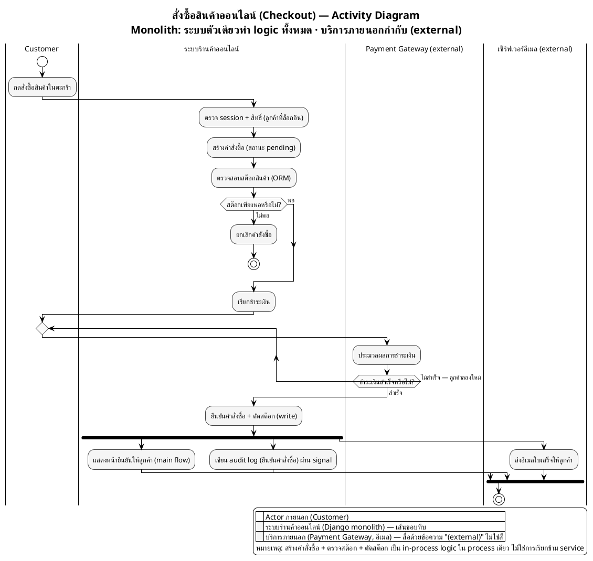

# ตัวอย่าง — Activity Diagram ที่ทำตามกฎครบทุกข้อ (Monolith)

> ตัวอย่างนี้ใช้ระบบสมมติ **"ระบบสั่งซื้อสินค้าออนไลน์"** (Django MVT monolith) เพื่อสาธิตกฎทั้งหมดใน [`activity_diagram_generate_guide.md`](../guide/activity_diagram_generate_guide.md) — ไม่ผูกกับโครงงานใดโครงงานหนึ่งโดยเฉพาะ ใช้เป็นตัวอย่างอ้างอิงได้กับทุกโปรเจกต์

จุดที่ตัวอย่างนี้สาธิตให้เห็น:
- **partition ระบบตัวเดียว** — `ระบบร้านค้าออนไลน์` ทำทั้งสร้างคำสั่งซื้อ + ตรวจสต๊อก + ยืนยันคำสั่งซื้อ (logic ทั้งหมดอยู่ใน process เดียว ไม่แยกตาม endpoint และไม่แยกเป็น service ย่อย)
- **ไม่มี API Gateway / ไม่มีตรวจ JWT ทุก request** — สมมติผู้ใช้ล็อกอินแล้ว (session ผ่าน allauth) flow เริ่มที่ actor ได้เลย · การตรวจสิทธิ์เป็น step แรกในฝั่งระบบ ไม่ใช่ partition แยก
- **บริการภายนอกจริงเป็น partition เส้นขอบประ** — `Payment Gateway` และ `เซิร์ฟเวอร์อีเมล` อยู่นอกโปรเจกต์ Django จึงกำกับ `(external)`
- **Loop ด้วย `repeat`/`repeat while`** — ชำระเงินไม่สำเร็จ วนกลับให้ลูกค้าลองใหม่ (ไม่มี Gateway ให้ผ่านทุกรอบ)
- **Audit log + อีเมลแบบ non-blocking ด้วย `fork`/`end fork`** — ผ่าน Django signal / async task ไม่บล็อกการตอบลูกค้า
- **Monochrome ล้วน** — แยกบทบาทด้วยข้อความ `(external)` แทนสี

---

