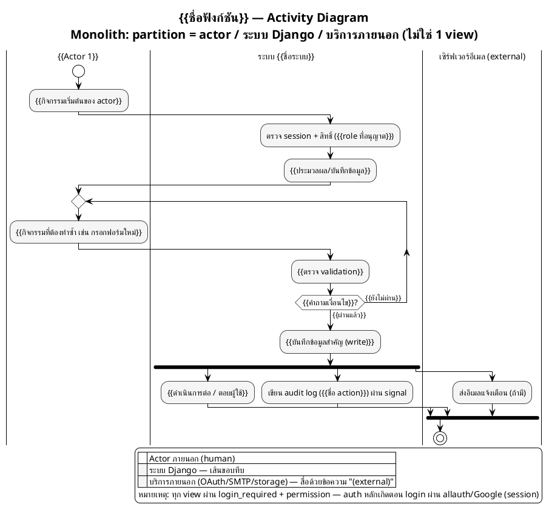

# Template — Activity Diagram แบบมี Swimlane (`.puml`)

> วิธีใช้: คัดลอกโค้ด PlantUML ด้านล่างไปที่ `<app>/activity_<ชื่อฟังก์ชัน>.puml`
> แทนที่ `{{...}}` ด้วยข้อมูลจริง และลบ/เพิ่ม partition, activity, fork, loop ตามจำนวนจริงของกระบวนการ
> ต้องทำตามกฎใน [`activity_diagram_generate_guide.md`](../guide/activity_diagram_generate_guide.md) ทุกข้อ โดยเฉพาะ **partition = actor/ระบบ Django/บริการภายนอก (ไม่ใช่ 1 view)**, **ไม่มี API Gateway/JWT — auth เกิดตอน login เท่านั้น**, และ **ห้ามใช้สีหลายโทน (monochrome เท่านั้น)**
> ดูตัวอย่างที่กรอกครบแล้วได้ที่ [`activity_diagram_example.md`](../example/activity_diagram_example.md)

---

